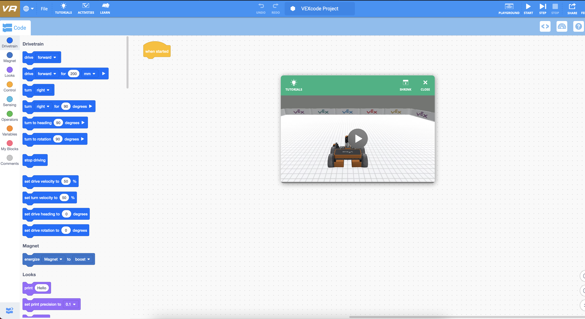
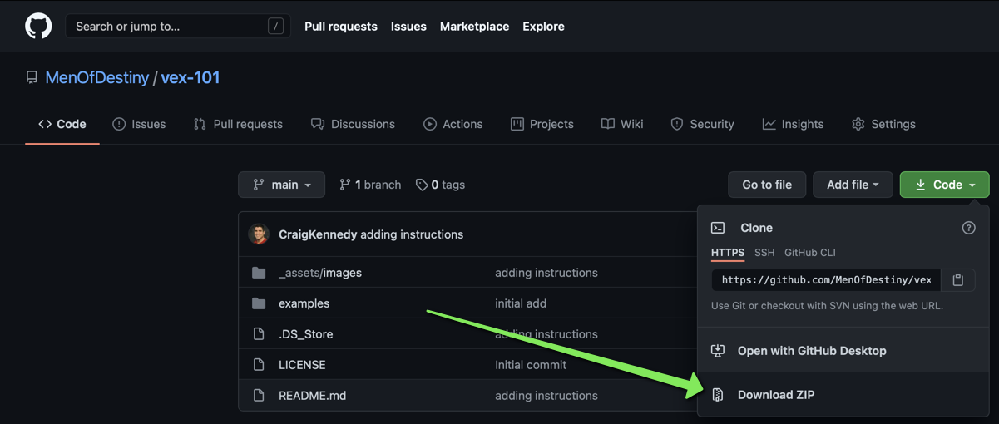
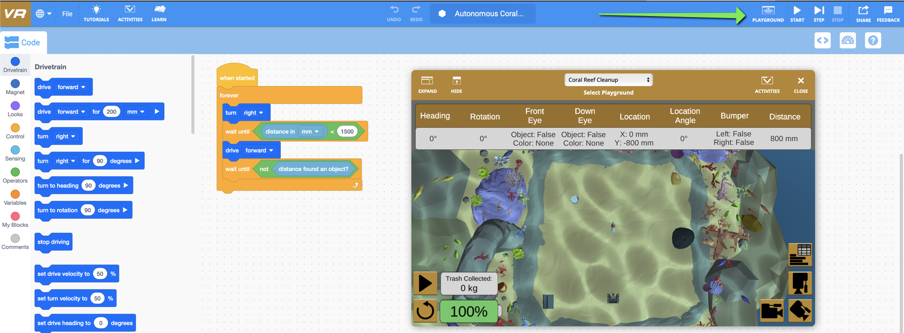
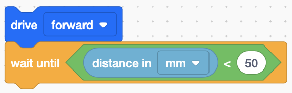

# vex-101

This course is designed to be an introduction to computer programming using robotics.

## VEX Robotics Introduction

VEX Robotics VR is an easy-to-use platform to help students learn Computer Science without a physical robot.

This class is loosely based on materials prepared by the educators at VEX Robotics.  More details and more in-depth learning can be found [here](https://education.vex.com/stemlabs/cs/computer-science-level-1-blocks).

## Getting Started

### What You Need

- A computer or tablet with internet access
- An open mind and willingness to learn

### How To Launch

Using your web browser, navigate to [https://vr.vex.com](https://vr.vex.com).  You should see a screen that looks like this:

### Examples

1. First, you will need to download the example files to your computer.  The easiest way to download them is to download a zip file of the entire directory. You can do this by clicking the `Code` menu and choosing `Download ZIP`. Once downloaded, you will need to unzip these files to have access to the individual example files on your computer.

1. In the VEX application in your browser, int the file menu (upper left corner), choose `Load From Your Device` and choose the file you want to load.

1. Once the file has been loaded into your virtual environment, you should see a screen similar to the following:

    > NOTE: If you do not see the Playground with the coral reef, click the `Playground` link at the top of the window.

1. Experiment with this program and all of the options and see how much trash you can pick up off the ocean floor.

#### Block Types

There are many different types of blocks you can use. They are grouped into different sections.

- Drivetrain (blue) - Moving the robot's wheels (drive forward, turn right, etc.)
- Control (yellow) - Waiting, Looping, checking conditions
- Sensing (light blue) - Read values from the built-in sensors (distance, color, bumpers)
- Operators - Comparing values, rounding or random numbers

#### Wall Maze

[WallMaze.vrblocks](./examples/WallMaze.vrblocks)

This example gives a simple introduction to the front-facing distance sensor. Here are [more details](./_assets/documents/distance-sensor.pdf) on the distance sensor.

> There are two types of mazes in the VR Playground

> - Static Maze: The maze has the same walls in the same locations every time you run your robot through the maze.
> - Dynamic Maze: The maze walls are redrawn in different locations each time you reset the maze.

> This example assumes you are using the **Static Maze**. The dynamic maze requires a higher skill level and if time allows, we will continue toward coding the robot to navigate a dynamic maze using the sensors on the robot itself.

Rather than giving specific driving directions to navigate the maze (drive forward 200mm, turn left 90 degrees, drive forward 200m, etc), this example adds the front distance sensor to "drive until it almost touches a wall".  This command is built up with 4 commands:

- drive forward
- wait until - continues to execute the previous action until "something" happens.
- comparison operator - compares one value to another
- sensor input - reports the distance sensor's distance to the object it sees in front of it.

All of these are layered together to look like this:

> This example drives forward until the distance sensor detects an object within 50 millimeters.

#### Autonomous Coral Reef

[Autonomous Coral Reef](./examples/AutonomousCoralReef.vrblocks)