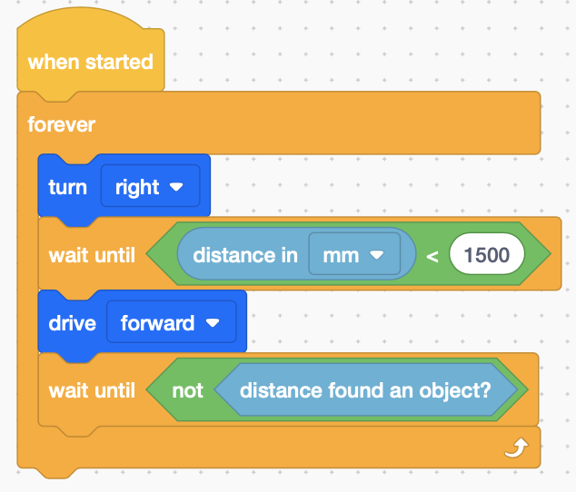

# Example - Autonomous Coral Reef

[Autonomous Coral Reef](./examples/AutonomousCoralReef.vrblocks)

## Summary

Rather than wandering back and forth through the reef (and potentially unnecessarily running down our battery), we can use the ultrasonic distance sensor we learned about in the [wall maze example](./example-wallmaze.md).

## Blocks Used

This example expands a bit on our control blocks. We'll use some new blocks in this example:

- Comparison Operator (compare one value to another value)
- Not operator (take the opposite of a value)
- Forever - keep performing the actions inside this block until you stop the program (or your robot runs out of battery).
- Wait Until - Keep performing the previous block's action until the condition defined inside the block is met.

## Example View

The outer 'forever' block says to execute the blocks inside forever. When it reaches the last instruction, it starts again at the top block inside the forever loop.

This code will ask the robot to spin (in place) to the right until it sees an object with it's distance sensor (within 1500mm or most of the distance of our reef example). Once it sees an object within the desired distance, drive forward to pick it up.

Once the robot picks up the trash and there are no more objects found in the distance, loop back to the top and start spinning in place until a piece of trash is found to go and pick up.

## Advantages

One advantage of this approach is that your robot is not driving from one end of the reef to the other if there isn't trash to pick up, increasing its efficiency.

By using the sensors, you _should_ be able to apply this same program to different size reef courses. The more reefs of different shapes and sizes your robot can clean, the more in-demand your creation will be.