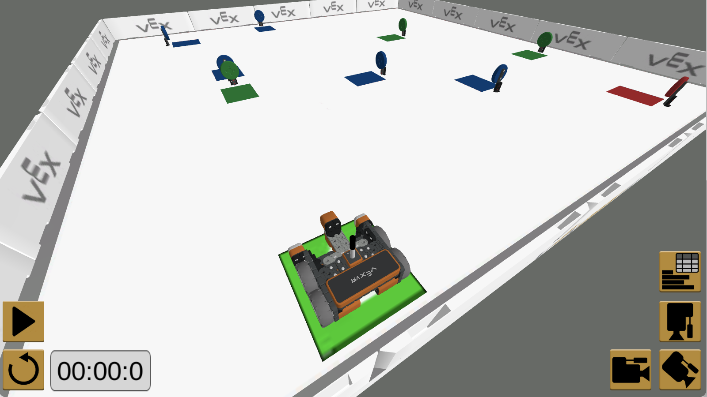
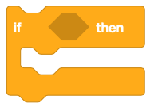
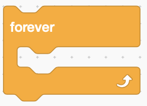
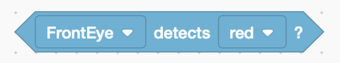
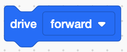
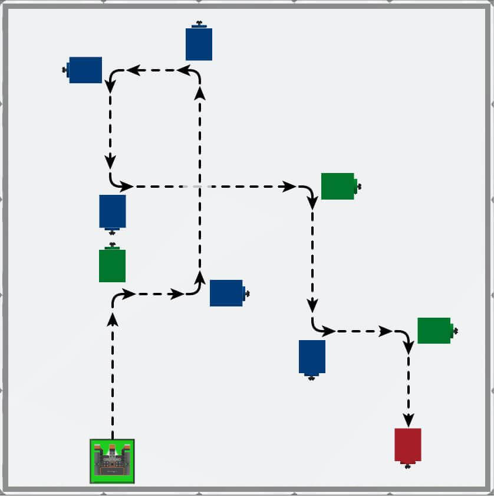
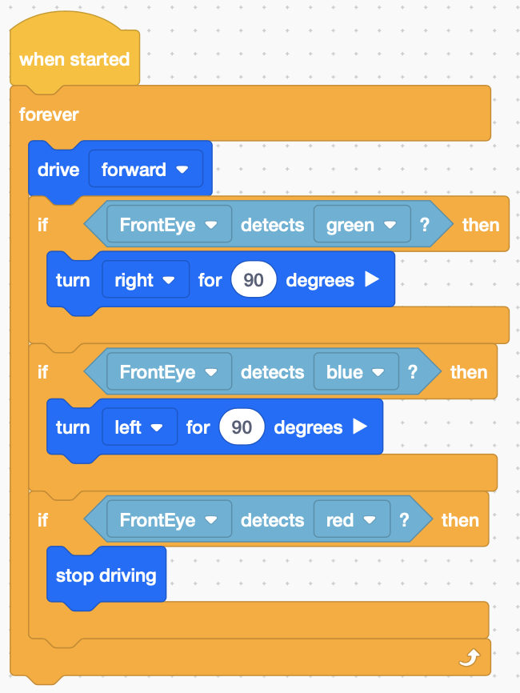

# Example - Disk Maze

[Disk Maze](./examples/diskmaze.vrblocks)

## Summary

You will learn how to use the Eye Sensor and conditional statements to solve the Disk Maze Challenge. In the Disk Maze Challenge, the VR Robot will navigate through the Disk Maze Playground from start to finish using the Eye Sensor to detect colors.

## Concepts

By `conditional statements`, they mean "If `something` Then `perform a task`".

For example: If `the front eye detects green` Then `turn right 90 degrees`

## Blocks Used

- if...then: If a condition is true, perform an action.

- forever: Repeat until something tells it to stop

- Eye Sensing: returns 'true' if the eye detects a color

- Drive Forward: Keep driving until something tells the robot to stop

- Turn {direction} {x} degrees - Turn left or right for a specified number of degrees (90 = quarter turn).

## Example View

The goal is to drive through the entire maze starting at the green square and stopping at the red disk.

### Partial Solution

## Challenge

Once you get to the red disk, go back to the start and do the maze over and over until you press the stop button on the program.