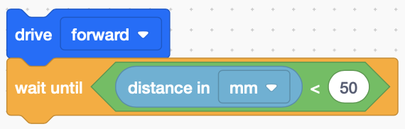

# Example - Wall Maze Using Distance Sensor

[WallMaze.vrblocks](./examples/WallMaze.vrblocks)

## Summary

This example gives a simple introduction to the front-facing distance sensor. Here are [more details](./_assets/documents/distance-sensor.pdf) on the distance sensor.

## Blocks Used

- Drive Forward
- Wait Until - continues to execute the previous action until "something" happens
- Comparison Operator - compares one value to another
- Sensor Input - reports the distance sensor's distance to the object it sees in front of it

## Example View

Rather than giving specific driving directions to navigate the maze (drive forward 200mm, turn left 90 degrees, drive forward 200m, etc), this example adds the front distance sensor to "drive until it almost touches a wall".

## Advantages

Our program is very specific to this maze and any new walls introduced would likely cause our robot to fail. However, this example gently introduces the concepts of using sensor input to navigate the maze.

As skills develop, we should be able to navigate **any** maze with the same program, increasing the flexibility and usefulness of our robot.

## Special Notes

There are two types of mazes in the VR Playground

- Static Maze: The maze has the same walls in the same locations every time you run your robot through the maze.
- Dynamic Maze: The maze walls are redrawn in different locations each time you reset the maze.

This example assumes you are using the **Static Maze**. The dynamic maze requires a higher skill level and if time allows, we will continue toward coding the robot to navigate a dynamic maze using the sensors on the robot itself.
